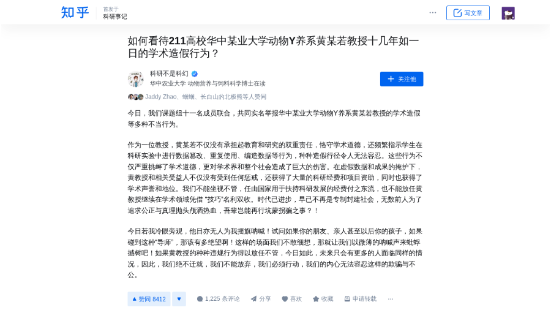
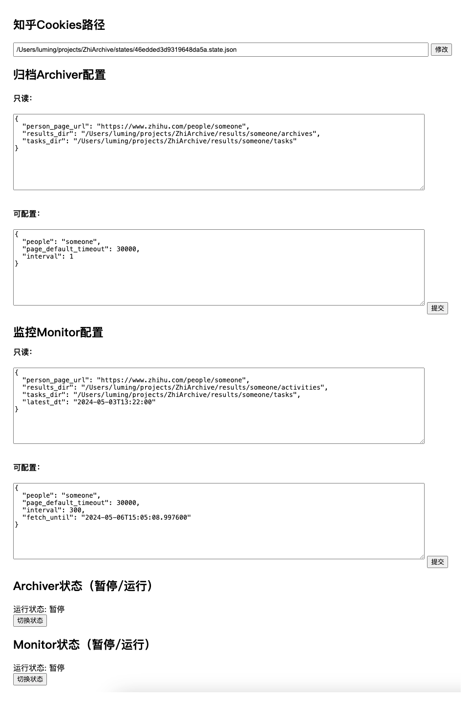

# ZhiArchive

**监测知乎用户的个人动态并保存内容以防丢失。**

某用户的动态结果保存目录如下：
`activities`为个人动态页快照，`archives`为动态对应的回答/文章快照

```
.
├── activities
│   ├── 2024
│   │   └── 01
│   │       └── 17
│   │           ├── 回答-为什么只有饿死的狮子而没有饿死的老虎？说明了什么问题？.png
│   │           ...
│   │           └── 赞同-如何看待211高校华中某业大学动物Y养系黄某若教授十几年如一日的学术造假行为？.png
│   └── 20240117181850.json
└── archives
    └── 2024
        └── 01
            └── 17
                ├── 回答-为什么只有饿死的狮子而没有饿死的老虎？说明了什么问题？
                │   ├── info.json
                │   └── 回答-为什么只有饿死的狮子而没有饿死的老虎？说明了什么问题？.png
                ...
                └── 赞同-如何看待211高校华中某业大学动物Y养系黄某若教授十几年如一日的学术造假行为？
                    ├── info.json
                    └── 赞同-如何看待211高校华中某业大学动物Y养系黄某若教授十几年如一日的学术造假行为？.png

16 directories, 25 files
```

其中：
**动态**文件`activities/2024/01/17/赞同-如何看待211高校华中某业大学动物Y养系黄某若教授十几年如一日的学术造假行为？.png`如图：


**目标**文件`archives/2024/01/17/赞同-如何看待211高校华中某业大学动物Y养系黄某若教授十几年如一日的学术造假行为？/赞同-如何看待211高校华中某业大学动物Y养系黄某若教授十几年如一日的学术造假行为？.png`如图：



`archives/2024/01/17/赞同-如何看待211高校华中某业大学动物Y养系黄某若教授十几年如一日的学术造假行为？/info.json`内容为：

```
{
  "title": "如何看待211高校华中某业大学动物Y养系黄某若教授十几年如一日的学术造假行为？",
  "url": "https://zhuanlan.zhihu.com/p/678136207",
  "author": "zhang-li-28-1",
  "shot_at": "2024-01-17T18:19:13.783"
}
```

## 它是如何工作的

`ZhiArchive`使用[Playwright](https://github.com/microsoft/playwright)，它由4个部分组成，分别是monitor，archiver，login worker和api：

- **monitor**：用于监测用户个人主页的动态并将新的动态：打快照，把动态的目标（回答、文章）链接通过redis丢给**archiver**。
- **archiver**：打开目标链接并保存屏幕快照至本地。
- **login worker**：用于登录知乎获取**monitor**和**archiver**所必需的认证信息。
- **api**：提供接口来操作控制**monitor**，**archiver**，**login worker**。

## 使用

*注意查看日志跟踪运行状态*

*archiver: archiver.log*

*monitor: monitor.log*

*login_worker: login_worker.log*


### Docker

#### 下载本项目

```sh
# 下载本项目
git clone https://github.com/amchii/ZhiArchive.git
# 进入项目目录
cd ZhiArhive
```

#### 构建镜像

```sh
docker build -t zhi-archive:latest -f BaseDockerfile .
```

这会从微软镜像仓库拉取playwright的镜像，注意你的网络环境。

#### 配置环境变量

现在支持**0配置**启动，你若是只想在本机**试用本项目，可以忽略这一步**。

但是当部署在云服务器上并暴露API端口时，**强烈建议**配置`.apienv`启用接口认证。

所有可配置项见[config.py](./archive/config.py)：

支持通过环境变量或`.env`，`.apienv`文件配置

`.env`文件

```
secret_key=  # 请生成一个随机字符串
```

`.apienv`文件

```
# API认证账号，配置用户名和密码
enable_auth=true
username=
password=
```

####

#### 启动

##### 常规方式

```
docker compose up -d
```

这会为每个worker启用一个容器，同时运行一个redis实例。

##### 单独部署redis

若你想单独部署redis，可以使用`docker-compose2.yaml`，需要通过环境变量或`.env`文件配置redis，如：

```
redis_host=172.17.0.1
redis_port=6379
redis_passwd=apassword
```

启动服务：

``````
docker compose -f docker-compose2.yaml up -d
``````


API端口为9090，以127.0.0.1为例，
打开[http://127.0.0.1:9090/docs](http://127.0.0.1:9090/docs)可查看接口文档。

若你启用了接口认证，调用接口之前请先打开[http://127.0.0.1:9090/auth/login](http://127.0.0.1:9090/auth/login)登录获取本项目的接口认证信息（Cookies）

#### 初始化

1. ##### 登录知乎获取Cookie

   打开[http://127.0.0.1:9090/zhi/login](http://127.0.0.1:9090/zhi/login)获取知乎登录二维码：
   

   扫码完成登录后将**自动应用**获取的Cookie并重定向到配置页面http://127.0.0.1:9090/zhi/core/config：

2. ##### 配置页

   `states/46edded3d9319648da5a.state.json`即保存的cookies文件，上一步登录成功后自动设置，所以如果你有该文件，也可以不登录直接设置为你的文件路径。

   

   Monitor默认每5分钟监测一次，配置项含义见[config.py](./archive/config.py)。

#### 运行Monitor和Archiver

Monitor和Archiver默认是暂停状态，通过配置页的`归档Archiver配置`和`监控Monitor配置` 更改`people`为你想要监控的知乎用户名，通过下方的`切换状态`按钮可以控制运行状态，注意观察日志文件的输出。

## 已知问题

1. 即使是无头模式，Chromium浏览网页和截图时占用内存依然较高，在低内存的云服务器上可能会崩溃（需要数百MB，最好通过docker的`--memory`限制下，参考`docker-compose2.yaml`）
2. 超长的回答/文章可能会截图失败（playwright抛出错误），经测试内存越大能截的图越长


## TODO

- 所有元素selector可配置
- 通过接口完全控制`Monitor`, `Archiver`
- 支持监测多个用户
- 异常告警
- 提供前端界面
- 存档任务失败处理


## 欢迎交流，Star⭐️一下，随时更新
