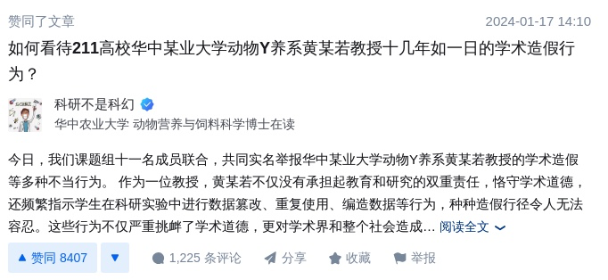
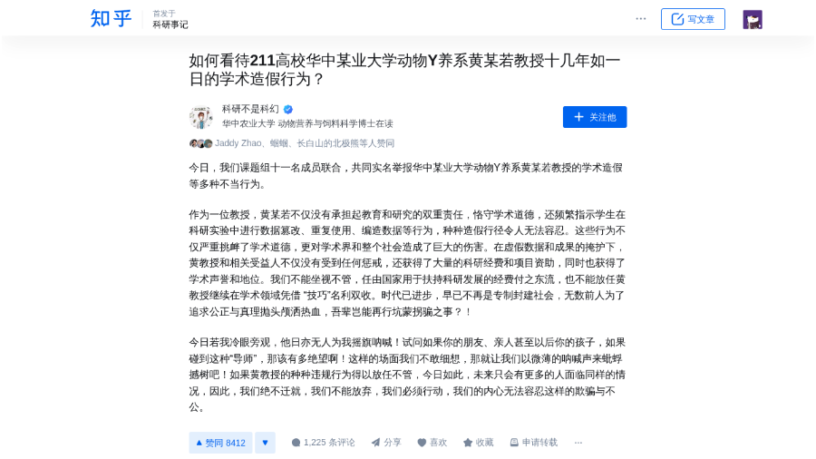
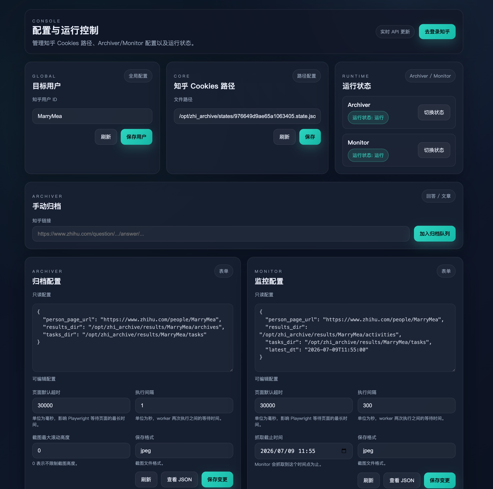

# ZhiArchive

监测知乎用户动态，并将相关回答、文章和想法保存到本地。

当前版本：`26.7.0`

ZhiArchive 基于 Playwright、FastAPI 和 SQLite 工作，适合以单机单实例方式长期运行，用于保存指定知乎用户的公开动态和动态关联内容。

## 功能

- 监测指定知乎用户的动态页。
- 保存动态卡片截图和动态 JSON 快照。
- 对动态中的回答和文章触发归档，保存长截图、元信息、HTML 和 Markdown。
- 对赞同或发布的想法保存动态截图。
- 支持在控制台手动提交回答或文章链接，主动触发归档。
- 提供支持独立 Bearer Token 和可选本机匿名访问的 MCP 接口，供 AI Agent 读取内容、
  提交归档和发起登录。
- 提供 Web 控制台管理登录状态、Cookie 路径、目标用户、运行状态和后台任务配置。
- 提供只读结果浏览器，在线查看动态截图、JSON、HTML 和 Markdown 归档。
- 支持 Docker 部署，也支持本地 `uv` 环境运行。

## 输出结构

某个用户的归档结果大致如下：

```text
results/<people>/
├── activities
│   ├── 2026
│   │   └── 07
│   │       └── 09
│   │           └── 赞同-某条动态-12345678.jpeg
│   └── 20260709120000.json
├── archives
│   └── 2026
│       └── 07
│           └── 09
│               └── 赞同-某篇回答-12345678
│                   ├── info.json
│                   ├── 赞同-某篇回答-12345678.jpeg
│                   ├── 赞同-某篇回答-12345678.html
│                   └── 赞同-某篇回答-12345678.md
```

`info.json` 示例：

```json
{
  "title": "某篇回答标题",
  "url": "https://www.zhihu.com/question/1/answer/2",
  "author": "author-id",
  "shot_at": "2026-07-09T12:00:00.000000",
  "text_archive": {
    "html": "赞同-某篇回答-12345678.html",
    "markdown": "赞同-某篇回答-12345678.md"
  }
}
```

说明：

- `activities` 保存动态页卡片截图和本次监测到的动态 JSON。
- `archives` 保存回答或文章归档。
- 待归档任务保存到本地 SQLite 数据库，不再写入新的任务 JSON 文件。
- HTML 是更接近知乎正文排版的文本归档，Markdown 便于搜索、阅读和二次处理。

## 结果浏览器

API 服务启动后访问：

```text
http://127.0.0.1:9090/zhi/results
```

结果浏览器会列出 `results/<people>/activities` 和
`results/<people>/archives`，支持图片、JSON、Markdown、HTML 和纯文本预览，
也可以下载原始文件。任务队列目录 `tasks` 不会显示，页面不提供删除、重命名或上传操作。

文本文件的在线预览上限为 1 MiB，超过限制时请直接下载。HTML 归档通过浏览器沙箱和
Content Security Policy 加载，避免归档内容访问控制台页面。

> 结果文件可能包含个人归档数据。将 API 暴露到公网前，请参考[安全](#安全)小节完成鉴权和公网部署配置。

动态卡片截图示例：

<p>
  
</p>

回答/文章截图示例：

<p>
  
</p>

## 模块

- `api`：提供 Web 控制台和配置接口，并通过 FastAPI lifespan 启动后台任务。
- `monitor`：监测目标用户动态，保存动态截图，并将回答/文章任务写入 SQLite。
- `archiver`：从 SQLite 领取归档任务，按 payload 中固化的目标用户目录打开并保存回答或文章的截图、HTML、Markdown 和元信息。
- `login task`：由 API 按需创建二维码登录任务，并保存 Playwright storage state。
- `sqlite`：保存运行时配置、暂停状态、抓取检查点、登录任务和归档任务队列。

## 本地运行

项目依赖由 `uv` 管理，不提交 `uv.lock`。首次运行或依赖变更后执行：

```sh
uv venv
uv pip install -r requirements.txt
uv pip install --group dev
. .venv/bin/activate
playwright install chromium
```

如需使用国内 PyPI 镜像，可在安装前设置：

```sh
export UV_DEFAULT_INDEX=https://pypi.tuna.tsinghua.edu.cn/simple/
```

运行 API：

```sh
bash run_api.sh
# 可选：指定监听地址和端口
bash run_api.sh 127.0.0.1 9090
```

`run_api.sh` 的 host 和 port 参数默认分别为 `0.0.0.0` 和 `9090`，并固定使用一个
Uvicorn worker。monitor、archiver 和二维码登录任务会在同一个 API 进程中启动，
不再单独运行 worker。

代码检查和测试：

```sh
ruff check archive tests
pytest
```

更新运行依赖导出文件：

```sh
uv pip compile pyproject.toml -o requirements.txt
```

## Docker

### 一键安装

安装脚本会检查 Git、Docker 和 Docker Compose，自动 clone（尚未在仓库内时）、
创建运行目录、生成随机 `secret_key`、构建镜像，并启动单个 API 应用实例。
脚本不会覆盖已有的 `.env`。

通过 GitHub 安装（Linux、macOS 或 WSL）：

```sh
curl -fsSL https://raw.githubusercontent.com/amchii/ZhiArchive/main/install.sh | bash
```

使用国内软件源构建镜像，或指定安装目录：

```sh
curl -fsSL https://raw.githubusercontent.com/amchii/ZhiArchive/main/install.sh \
  | bash -s -- --cn --dir /path/to/ZhiArchive
```

通过 GitHub 安装（Windows PowerShell，需要 Docker Desktop 使用 Linux 容器）：

```powershell
irm https://raw.githubusercontent.com/amchii/ZhiArchive/main/install.ps1 | iex
```

如果访问 GitHub 困难，可以从 Gitee 获取脚本并从 Gitee clone。下面的命令也会使用
`CN.Dockerfile` 中配置的国内软件源：

```sh
curl -fsSL https://raw.giteeusercontent.com/amchii/ZhiArchive/raw/main/install.sh \
  | bash -s -- --gitee --cn
```

Windows PowerShell：

```powershell
$installer = irm https://raw.giteeusercontent.com/amchii/ZhiArchive/raw/main/install.ps1
& ([scriptblock]::Create($installer)) -Gitee -ChinaMirror
```

也可以先 clone，再在仓库内运行 `bash install.sh` 或
`powershell -ExecutionPolicy Bypass -File .\install.ps1`。使用 `--no-start`（PowerShell
中为 `-NoStart`）可以只完成初始化和镜像构建。Unix 脚本的 `--gitee` 和
PowerShell 脚本的 `-Gitee` 会将 clone 地址切换到 Gitee；显式传入 `--repo`、
`-Repository` 或 `ZHIARCHIVE_REPOSITORY` 时，自定义地址优先。完整参数可运行
`bash install.sh --help` 或 `Get-Help .\install.ps1 -Detailed` 查看。

安装完成后打开：

```text
http://127.0.0.1:9090/zhi/core/config
```

> 一键安装沿用 `docker-compose.yaml` 的端口配置。部署到公网前，请参考[安全](#安全)小节完成鉴权和公网部署配置。

### 手动安装

下载项目：

```sh
git clone https://github.com/amchii/ZhiArchive.git
cd ZhiArchive
```

也可以从 Gitee 下载：

```sh
git clone https://gitee.com/amchii/ZhiArchive.git
cd ZhiArchive
```

构建国内源镜像：

```sh
docker build -t zhi-archive:latest -f CN.Dockerfile .
```

启动单应用实例：

```sh
docker compose up -d
```

SQLite 数据库默认位于 `var/zhi_archive.sqlite3`。容器部署时请持久化 `var/`、`states/`、`results/` 和 `logs/`。

> 容器内 Chromium 在 root 用户下无法以沙盒模式启动，公网部署时请参考[安全](#安全)小节中的 Docker 部署建议。

## 初始化

默认 API 端口是 `9090`。以本机为例，打开：

```text
http://127.0.0.1:9090/zhi/core/config
```

首次使用建议按以下步骤操作：

1. 在控制台点击“去登录知乎”，进入登录页。
2. 点击获取二维码按钮，使用知乎 App 扫码登录。
3. 登录成功后返回配置页。
4. 在“目标用户”中填写知乎用户 ID。
5. 配置 monitor 和 archiver 参数。
6. 在“运行状态”中切换后台任务状态。

如果已有可用的 Playwright storage state 文件，或从浏览器扩展导出的 Cookies JSON，也可以在配置页直接上传并启用，不必重新扫码。应用会把登录态写入 `states/zhihu.state.json`；Docker 部署时该文件通过 `states/` 挂载持久化，配置页不会暴露或保存容器内部路径。

## MCP 接入

MCP Server 与主服务运行在同一进程，通过 Streamable HTTP 暴露：

```text
http://127.0.0.1:9090/mcp/
```

MCP 和直接本机匿名访问默认开启，远程请求使用独立 Bearer Token，不复用控制台
Cookie。未配置 Token 不影响 MCP 启动，但非本机请求无法通过 Bearer 鉴权。本机匿名
访问只接受回环客户端、回环 Host/Origin 且不带代理身份头的请求，不把 Docker 或局域
网地址视为本机，也可在配置控制台关闭。同机反向代理若不保留来源头并把后端 Host
改为回环地址，在应用层可能被识别为本机；使用反向代理时应关闭匿名访问。Token 明文
只在生成或轮换时显示一次，主服务仅在 SQLite 中保存摘要；生成新 Token 会立即使旧
Token 失效。

当前提供以下工具：

- `read_zhihu_content`：即时读取知乎回答或专栏文章，支持 Markdown、HTML 和分页。
- `read_zhihu_question`：读取问题本身的描述、话题、作者、统计和时间信息。
- `list_zhihu_hot_questions`：读取当前知乎热榜问题，最多返回 30 条，不提供分页。
- `list_zhihu_profile_items`：分页查看用户发布的回答、文章、想法或收藏夹；
  省略用户 ID 时使用当前全局目标用户。
- `list_zhihu_collection_items`：使用收藏夹 ID 分页查看其中的内容。
- `get_zhihu_auth_status`：读取不包含 Cookie 的登录态摘要。
- `get_zhihu_archiver_status`、`resume_zhihu_archiver`：读取 Archiver 的暂停、
  运行和后台任务状态，并恢复队列运行。
- `enqueue_zhihu_archive`、`get_zhihu_archive_task`：提交并查询现有归档任务；
  入队和查询结果均包含当前 Archiver 状态，完成任务还会返回归档目录及截图、
  元信息、HTML、Markdown 等已生成文件。归档目录相对于 `results/`，文件信息仅为
  文件名，不表示 MCP 客户端可以通过服务器文件系统路径访问内容。
- `read_zhihu_archive_artifact`：通过已完成任务 ID 分页读取 `info`、`markdown`
  或 `html` 文本产物。
- `get_zhihu_archive_screenshot`：通过已完成任务 ID 直接获取 MCP Image 截图；
  两个产物工具均不接受调用方提供的文件路径。
- `start_zhihu_login`、`get_zhihu_login_status`、`get_zhihu_login_qrcode`：发起并完成二维码登录。

ReaderWorker 与 Archiver 是共同继承 `ZhihuContentWorker` 的兄弟 worker，复用知乎页面
访问、元数据补全和正文抽取能力。Reader 同时负责个人列表的结构化读取，使用独立
Browser 和有界队列，每次读取创建独立 BrowserContext，且不会把请求上下文中的 Cookie
写回托管 state；截图、保存格式和归档队列等 Archiver 语义不会进入 Reader。Monitor 和
Archiver 继续使用原有后台队列和浏览器并发控制。Reader 在首次读取时按需启动，MCP
未使用时不会影响主服务健康状态。

问题由登录 BrowserContext 正常打开问题页并解析 `#js-initialData` 中的结构化数据；
热榜和个人列表则直接请求知乎页面实际使用的 JSON API，并分别设置热榜页及回答、
文章、想法和收藏夹页面 Referer。默认在相邻请求间等待 2～3 秒，相同问题、热榜或
分页缓存 30 秒；列表 API 收到 403 或 429 后停止继续请求，并按 `Retry-After` 和指数
退避进入最长 15 分钟的本地冷却。
可通过同名大写环境变量调整 `profile_request_min_interval_seconds`、
`profile_request_jitter_seconds`、`profile_cache_ttl_seconds`、
`profile_cooldown_base_seconds` 和 `profile_cooldown_max_seconds`。

登录二维码页面示例：

<p>
  
</p>

配置控制台示例：

<p>
  
</p>

## 配置

配置来源包括环境变量、`.env`、`.apienv` 和 SQLite 中的运行时配置。常见配置项见 [archive/config.py](./archive/config.py)。

公网暴露 API 时，务必启用鉴权，详见[安全](#安全)小节。

控制台中的目标用户是全局配置，会同时影响 monitor 和 archiver。monitor 和 archiver 的可编辑配置保存在 SQLite 中，修改 `.env` 默认值不会覆盖已保存的运行时配置。

## 安全

ZhiArchive 会保存知乎登录态、Cookie、截图和归档内容，这些数据属于敏感信息。将 API 暴露到公网前，请务必完成以下配置。

### API 鉴权

在 `.apienv` 中启用 HTTP Basic Auth：

```env
enable_auth=true
username=你的用户名
password=你的密码
# 仅当前端与 API 不同源时配置；多个 Origin 使用英文逗号分隔
cors_allowed_origins=https://console.example.com
```

`cors_allowed_origins` 默认为空，此时 API 只支持同源访问。配置值必须是明确的 HTTP(S) Origin，不能使用 `*`，也不能包含路径或查询参数。

### 公网部署

- 通过防火墙或反向代理（Nginx、Caddy 等）限制对 API 端口的直接访问，只暴露必要端口。
- 为反向代理配置 HTTPS，避免凭证明文传输。
- 不要将未鉴权的控制台直接暴露到公网。
- `secret_key` 用于签名会话 Cookie，安装脚本会自动生成随机值；手动部署时请在 `.env` 中设置足够强度的 `secret_key`。

### Docker 部署安全

- 容器内 Chromium 在 root 用户下无法以沙盒模式启动，公网部署时建议限制容器权限和内存。
- 持久化目录（`var/`、`states/`、`results/`、`logs/`）包含敏感数据，应设置适当的文件系统权限，避免被其他进程读取。
- 参考 [Playwright Docker 安全建议](https://playwright.dev/docs/docker#security) 进行加固。

### MCP Token

远程 MCP 请求使用独立 Bearer Token 鉴权，不复用控制台 Cookie。Token 明文只在生成
或轮换时显示一次，请妥善保存；生成新 Token 会使旧 Token 立即失效。默认开启的本机
匿名访问会让本机所有进程都能调用 MCP，仅适合受信任的本机环境，不需要时应在控制台
关闭。同机反向代理可能让外部请求在应用层表现为回环请求，因此反向代理和公网部署应
关闭匿名访问并继续使用 Token；Docker 部署也应继续使用 Token。将 MCP 端点暴露到
公网时，同样建议通过反向代理配置 HTTPS。

## 手动归档

控制台支持直接提交知乎回答或专栏文章链接，例如：

```text
https://www.zhihu.com/question/2058247449894970042/answer/2058308278786987158
https://zhuanlan.zhihu.com/p/2055288243885709032
```

提交后会写入 SQLite 任务队列，由 archiver 按普通归档流程处理。

## 文本归档

回答和文章归档时会同时保存：

- 截图：`jpeg` 或 `png`
- HTML：更接近知乎正文排版
- Markdown：便于检索和二次处理
- 元信息：`info.json`

HTML 和 Markdown 是截图之外的附加产物。文本归档失败不会中断截图保存。

## 已知问题

- Chromium 截图占用内存较高，低内存服务器可能出现浏览器崩溃。
- 超长回答或文章仍可能触发 Playwright 截图失败。
- 知乎页面结构变化可能导致选择器失效，需要随页面更新适配。
- HTML/Markdown 文本归档更适合正文保存，不保证完整还原所有知乎交互组件。

## 变更记录

详见 [CHANGELOG.md](./CHANGELOG.md)。

## 许可证

本项目使用 MIT License。
