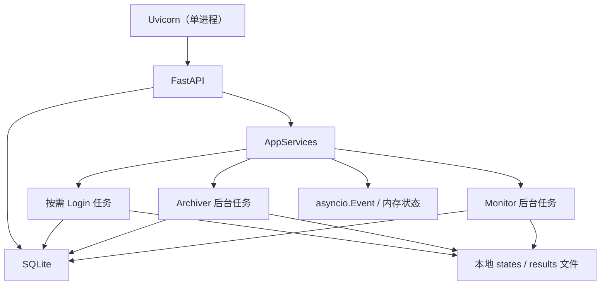

# 单进程与 SQLite 架构改造方案

状态：已确认，待实施

适用项目：ZhiArchive

决策目标：移除 Redis，将 API 与 Worker 合并到一个进程中运行

## 1. 背景

ZhiArchive 当前由 API、login worker、monitor、archiver 和 Redis 组成。Redis
承担以下职责：

- 保存全局配置和各 Worker 的运行时配置；
- 保存 Worker 的暂停状态和运行状态；
- 在 API、monitor 和 archiver 之间传递归档任务；
- 在 API 和 login worker 之间协调二维码登录任务；
- 保存当前使用的 Playwright storage state 路径。

这些职责都需要跨进程共享状态，但项目本身并不需要高吞吐队列、水平扩容、多主机部署或高可用 Redis。当前默认部署中，各组件被拆成多个进程或容器，反过来制造了对 Redis 的需要。

归档任务的完整内容当前保存为本地 JSON 文件，Redis 队列只保存文件路径。当前
archiver 使用 `LPOP` 后再执行归档，进程在处理过程中退出时，队列引用会丢失，
因而现有实现也不具备严格的可靠队列语义。此外，一个 monitor 任务文件可能包含
多条动态，任务状态和单条内容的归档结果无法准确对应。

## 2. 决策

项目调整为**单机、单实例、单应用进程**架构：

- 一个 Uvicorn 进程运行 FastAPI；
- FastAPI lifespan 负责启动和停止 monitor、archiver 等后台任务；
- 登录流程由 API 按需创建后台任务，不再运行常驻 login worker；
- 使用 SQLite 保存配置、运行状态、抓取检查点和归档任务 payload；
- 使用进程内对象和 `asyncio` 原语完成即时通知；
- 移除 Redis 服务、`redis` Python 依赖和独立 Worker 容器。

目标结构如下：



SQLite 是持久化数据的事实来源；进程内事件只用于减少轮询延迟，不能作为唯一任务队列。

新任务不再写入单独的任务 JSON 文件。每个需要深度归档的 `ActivityItem` 在
SQLite 中对应一行任务，并直接保存 JSON payload。现有 activities 文件继续作为
抓取结果留档；旧版 tasks 文件只用于迁移，不再作为新架构的运行时事实来源。

## 3. 明确的产品边界

本次改造主动接受以下限制：

- 只支持单机部署；
- 只允许运行一个应用实例；
- Uvicorn 固定使用一个 worker；
- 不支持多个 monitor 或 archiver 副本并行消费；
- API 和后台任务共同启动、共同退出；
- 进程退出时，正在执行的 Playwright 操作可以中断；
- 中断的归档任务允许在重启后从头执行；
- SQLite 数据库只放在本地磁盘，不支持 NFS 或多主机共享；
- 不实现分布式锁、死信队列、复杂熔断和自动水平扩容；
- 配置更新允许在 Worker 下一轮执行前生效，不保证对正在执行的任务即时生效；
- 同一时间只允许一个二维码登录任务。

这些限制属于项目的预期使用范围，不视为待修复的架构缺陷。如果未来明确需要多实例或多主机运行，应重新评估任务存储和协调方案，而不是在当前实现中提前加入分布式复杂度。

单实例是部署约束，不额外实现跨平台进程锁。项目提供的启动脚本和 Docker
Compose 必须固定一个 Uvicorn worker、一个容器副本；用户绕过标准入口同时启动
多个实例属于不受支持的误配置。应用启动日志应明确输出这一限制。

## 4. 不应放弃的基本保障

简化架构仍需满足以下底线：

- 已进入队列的归档任务不能因正常重启或进程崩溃而永久消失；
- 任务具有稳定 ID，并记录 `pending`、`running`、`done`、`failed` 状态；
- 应用启动时将上次遗留的 `running` 任务恢复为 `pending`；
- 任务状态领取和更新必须使用 SQLite 事务；
- FastAPI 关闭时应取消并等待后台任务退出；
- Playwright browser、context 和 page 必须在取消或异常时关闭；
- 配置写入不能产生只写入一半的状态；
- SQLite 应配置 WAL、`busy_timeout` 和外键约束；
- SQLite、cookie、二维码、日志和归档结果不得提交到 Git。

这里不追求 exactly-once。允许任务在崩溃恢复后重复执行，但不能因为先推进抓取
检查点、后写入任务而永久跳过内容。

## 5. 运行时组件

### 5.1 AppServices

新增应用级服务容器 `AppServices`，由 FastAPI lifespan 创建，并保存在
`app.state.services` 中。它至少持有：

- SQLite store；
- monitor 实例及其后台 `Task`；
- archiver 实例及其后台 `Task`；
- 当前 login 任务；
- 用于唤醒 archiver 的 `asyncio.Event`；
- monitor 与 archiver 共享的浏览器并发信号量；
- 用于停止各循环的关闭状态。

API 路由直接访问 `AppServices`，不再为每个请求构造临时 Worker 或存储客户端。

后台任务必须由 `AppServices` 持有强引用并接受监督：

- 初始化失败时，lifespan 启动失败，API 不进入就绪状态；
- 单次抓取或归档的可恢复异常由 Worker 循环记录，并在退避后继续；
- 顶层后台 Task 正常情况下只能因应用关闭而结束；
- Task 意外结束时，应用记录 critical 日志、将对应 Worker 标记为 `error`，并让
  健康检查返回失败，不能让 API 表面正常而 Worker 静默停止。

### 5.2 Monitor

Monitor 保留定时循环：

1. 等待暂停状态解除；
2. 从 SQLite 读取最新配置，并使用应用托管的固定 state 文件；
3. 抓取知乎动态；
4. 使用临时文件和原子重命名保存 activities 结果；
5. 在一个 SQLite 事务中写入逐条归档任务并推进抓取检查点；
6. 事务提交后设置 archiver 的进程内唤醒事件；
7. 等待下一次执行时间。

应用关闭时，Monitor 应响应任务取消，并由现有 Playwright 上下文管理逻辑释放浏览器资源。

activities 文件写入失败时，不得入队或推进检查点。文件写入成功但 SQLite 事务
失败时，允许留下未被引用的 activities 文件；下一轮会重新抓取，最多产生重复
留档，不会跳过动态。SQLite 中的任务插入和检查点推进必须在同一个事务中完成。

### 5.3 Archiver

Archiver 不再固定每秒查询 Redis。推荐流程：

1. 清除本轮唤醒事件；
2. 使用事务将最早可执行的一个 `pending` 任务领取为 `running`；
3. 持续领取并执行任务，直到没有可执行任务；
4. 成功后标记为 `done`；
5. 失败后记录错误、增加尝试次数，并根据简单重试规则标记为
   `pending` 或 `failed`。
6. 队列为空时等待 `asyncio.Event`，最多等待 30 秒后兜底重新扫描。

进程内事件只负责唤醒。即使事件丢失，启动扫描和可选的低频兜底扫描仍能找到 SQLite 中的任务。

生产者必须先提交 SQLite 事务，再调用 `event.set()`。消费者必须先
`event.clear()`，再查询数据库，避免在“确认队列为空”和“清除事件”之间丢失
唤醒。`asyncio.CancelledError` 不增加任务尝试次数；被取消时任务保持
`running`，下次启动统一恢复为 `pending`。

### 5.4 Login

Login 不再作为永久轮询 Worker 运行。创建二维码的 API 直接发起登录后台任务：

1. 检查是否已有未结束的登录任务；
2. 写入 login task；
3. 使用 `asyncio.create_task` 启动二维码生成和扫码等待流程；
4. 将状态更新为 `pending`、`waiting_for_scan`、`ok` 或 `failed`；
5. 登录成功后原子替换托管 state，API 继续通过任务 ID 查询状态和读取二维码文件。

应用重启后，无需恢复等待扫码的浏览器页面；未结束的登录任务直接标记为失败，用户重新获取二维码。

## 6. SQLite 数据模型

具体字段可在实现时微调，但应维持简单且明确的数据边界。

### 6.1 settings

| 字段 | 说明 |
| --- | --- |
| `key` | 配置键，主键 |
| `value` | JSON 编码后的值 |
| `updated_at` | 最后更新时间 |

建议包含：

- 全局目标用户；
- monitor 的执行间隔、页面超时和保存类型；
- archiver 的页面超时、保存类型和截图最大高度；
- 托管 storage state 的来源和内容修订值；state 文件本身保存在 `states/`。

配置来源按以下规则分层：

- `.env`、`.apienv` 和 `Settings` 只负责部署配置及初始默认值，包括数据库路径、
  results/states/logs 目录、浏览器类型、headless、日志和 API 鉴权；
- SQLite 保存允许通过控制台修改的运行时配置；
- 首次建库时，从 `Settings` 将运行时默认值写入 SQLite；
- 数据库建立后，运行时配置以 SQLite 为准，修改 `.env` 中对应默认值不会覆盖
  用户已保存的值；
- 派生值如 `person_page_url` 和 `results_dir` 不写入数据库，而是在读取基础配置后
  计算；
- 抓取进度不属于配置，单独保存在 monitor checkpoint 中。

数据库内的项目路径优先保存为相对于 `root_dir` 的路径。确需引用项目目录外文件
时才保存绝对路径，并在读取时校验文件是否存在。

### 6.2 worker_control

| 字段 | 说明 |
| --- | --- |
| `name` | `monitor` 或 `archiver`，主键 |
| `paused` | 是否暂停 |
| `status` | `running`、`waiting` 或 `error` |
| `last_error` | 最近一次错误，可为空 |
| `updated_at` | 最后更新时间 |

暂停状态需要持久化；运行状态主要用于控制台展示，不作为任务一致性的依据。

新数据库中的 monitor 和 archiver 默认 `paused = true`，保持当前首次部署行为。
用户完成登录和配置后，再通过控制台显式启动 Worker。

### 6.3 archive_tasks

| 字段 | 说明 |
| --- | --- |
| `id` | `ActivityItem.id`，主键 |
| `payload` | 单条 `ActivityItem` 的 JSON |
| `dedupe_key` | Monitor 任务的稳定去重键，可为空且唯一 |
| `status` | `pending`、`running`、`done` 或 `failed` |
| `attempts` | 已尝试次数 |
| `last_error` | 最近一次错误，可为空 |
| `next_attempt_at` | 下次允许重试的时间，可为空 |
| `created_at` | 创建时间 |
| `started_at` | 最近一次开始时间，可为空 |
| `finished_at` | 完成时间，可为空 |

第一版不需要实现复杂租约。由于只允许一个应用进程，启动时统一恢复遗留
`running` 任务即可。任务按 `created_at, id` 排序领取。

Monitor 每次抓取可以产生多条独立任务。某一条内容失败只影响自身，不影响同一轮
抓取产生的其他内容。Monitor 当前生成的 `ActivityItem.id` 是随机值，不能用于跨轮次
去重，因此入队时需要根据 `people`、`acted_at`、`action`、`target_type` 和标准化后的
目标链接生成稳定 `dedupe_key`。同一轮数据因崩溃被重新抓取时，唯一约束阻止重复
入队。

手动归档也生成一个 `ActivityItem`，沿用同一套表和状态语义，但默认不设置
`dedupe_key`，允许用户在内容更新后再次手动归档同一链接。

### 6.4 monitor_checkpoints

| 字段 | 说明 |
| --- | --- |
| `people` | 知乎用户 ID，主键 |
| `fetch_until` | 下一轮抓取使用的检查点 |
| `latest_dt` | 最近一次成功抓取到的最新动态时间 |
| `updated_at` | 最后更新时间 |

检查点按目标用户隔离。切换 `people` 时读取对应检查点；目标用户首次出现时，根据
`monitor_fetch_until` 的部署默认值创建初始检查点。控制台如果允许修改抓取起点，
实际操作的是此表，而不是普通配置。

### 6.5 login_tasks

| 字段 | 说明 |
| --- | --- |
| `id` | 登录任务 ID，主键 |
| `qrcode_path` | 二维码文件路径 |
| `status` | 登录任务状态 |
| `last_error` | 最近一次错误，可为空 |
| `created_at` | 创建时间 |
| `expires_at` | 过期时间 |

过期任务可以在创建新任务或应用启动时顺便清理，不需要专门的定时清理服务。

## 7. 并发与数据库使用约定

- 所有写操作使用短事务；
- 不在数据库事务中执行 Playwright 或文件 I/O；
- 领取任务时只在事务内完成状态转换，然后立即提交；
- 打开连接时设置 `journal_mode=WAL`、`busy_timeout=5000` 和
  `foreign_keys=ON`；
- 使用 `aiosqlite` 访问数据库，不在业务代码中混用同步 `sqlite3`；
- 第一版不引入 ORM 和迁移框架，使用 `PRAGMA user_version` 维护 schema 版本；
- 数据库损坏或 schema 不兼容时应给出明确错误，不要静默创建空库覆盖原文件。

`AppServices` 提供一个容量为 1 的 Worker 浏览器信号量，由 monitor 和 archiver
共享，避免两个长期任务同时启动 Chromium。登录和 state 验证属于交互操作，使用
另一个容量为 1 的信号量，因此最多允许一个后台 Worker 浏览器和一个交互浏览器
同时运行。该限制控制低内存部署的峰值占用，同时避免长时间 monitor 抓取阻塞扫码
登录。

## 8. 进程生命周期

FastAPI lifespan 的职责如下：

### 启动

1. 打开 SQLite，配置连接参数，并初始化或升级 schema；
2. 将遗留的 `running` 归档任务恢复为 `pending`；
3. 将未完成的登录任务标记为 `failed`；
4. 初始化运行时配置和各目标用户的抓取检查点；
5. 创建并验证 monitor 和 archiver；
6. 启动受监督的后台任务；
7. 如果已有待归档任务，立即唤醒 archiver；
8. 所有必需组件成功后，API 才进入就绪状态。

### 关闭

1. 设置关闭状态；
2. 唤醒正在等待的后台任务；
3. 取消 monitor、archiver 和 login 任务；
4. 等待任务执行清理逻辑；
5. 将被取消的登录任务标记为 `failed`；
6. 关闭 SQLite 连接。

应用提供轻量健康检查：数据库不可访问、monitor 或 archiver 顶层 Task 意外结束时
返回失败。Worker 因暂停而等待、单条任务失败或知乎暂时不可访问不影响应用健康
状态。

部署命令必须保持单进程，例如：

```sh
uvicorn archive.api.app:app --host 0.0.0.0 --port 9090 --workers 1
```

生产部署不启用自动 reload。开发时使用 reload 会中断并重新创建后台任务，应接受当前浏览器操作被取消。

项目不实现运行时跨进程锁，也不承诺检测用户自行启动的第二个应用实例。标准启动
脚本、Compose 和文档不得提供多 worker 或多副本配置。

## 9. 重试和幂等策略

第一版采用简单策略：

- 单个任务默认最多执行 3 次，前两次失败后分别等待 30 秒和 5 分钟；
- 应用崩溃遗留的 `running` 任务在下次启动时重新执行；
- 达到重试上限后标记为 `failed`，由控制台提供重新入队操作，重新入队时清除错误、
  重置尝试次数和下次执行时间；
- 归档目录继续使用稳定的动态 ID，重新执行时优先覆盖同一任务的文件；
- `asyncio.CancelledError` 不算执行失败，也不增加 `attempts`；
- 不保证 exactly-once，只保证任务可恢复且最终状态可见。

这是单机归档工具合理的可靠性边界。实现 exactly-once 会显著增加复杂度，但对当前项目没有相应收益。

## 10. 配置与部署变化

改造完成后：

- `.env` 删除 `redis_host`、`redis_port` 和 `redis_passwd`；
- 新增 `sqlite_path` 配置，默认值为 `var/zhi_archive.sqlite3`；
- 增加 `aiosqlite` 运行依赖；
- `pyproject.toml` 和 `requirements.txt` 删除 `redis`；
- Docker Compose 只保留一个应用服务；
- 删除 Redis volume 和各独立 Worker 服务；
- `run_api.sh` 成为默认启动入口；
- `run_monitor.py`、`run_archiver.py`、`run_login_worker.py` 和
  `run_all_workers_in_one.py` 在迁移完成后删除，或暂时保留为明确标注的开发工具；
- 安装脚本和 README 统一描述单容器部署方式。

`var/` 已在 `.gitignore` 中忽略。Docker 应将 `var/`、`states/`、`results/` 和
`logs/` 放在可持久化挂载中；数据库必须位于本地文件系统。

## 11. Redis 数据迁移

为保持现有用户配置兼容，不能仅删除 Redis。建议提供一次性迁移路径：

1. 提供一个仍可连接 Redis 的独立一次性迁移命令；
2. 导出全局配置、Worker 配置、暂停状态、state 路径和未消费任务；
3. 读取每个旧任务 JSON 文件，将其中的 `ActivityItem` 拆分为逐条 SQLite 任务；
4. 检查 payload 是否完整，并为 Monitor 任务计算 `dedupe_key` 后去重；
5. 将 monitor 的 `fetch_until` 和 `latest_dt` 迁移为对应用户的 checkpoint；
6. 输出迁移报告，包括跳过和失败项；
7. 确认 SQLite 数据可读取后，再切换到无 Redis 版本。

二维码登录任务和瞬时 Worker 运行状态无需迁移。Redis 中已声明但未使用的
`task_results`、`personal_key` 等数据也无需迁移。

如果项目明确只支持全新部署，可以省略迁移工具，但必须在发布说明中标记为破坏性变更。

## 12. 实施顺序

建议按以下顺序执行，避免同时改动全部运行链路：

1. 增加 SQLite schema、store 和单元测试；
2. 明确部署配置与运行时配置的字段映射；
3. 将配置、暂停状态和 monitor checkpoint 迁入 SQLite，并将登录态改为固定托管文件；
4. 将归档任务改为逐条 payload 入库，并补充失败恢复测试；
5. 将 login 改为按需后台任务；
6. 引入 `AppServices`、后台任务监督和 FastAPI lifespan；
7. 合并启动入口和 Docker Compose；
8. 增加一次性 Redis 到 SQLite 迁移命令；
9. 删除 Redis 代码与依赖；
10. 更新 README、安装脚本和发布说明。

不建议长期维护 Redis 和 SQLite 两套可选运行后端。短期迁移兼容完成后，应只保留单进程 SQLite 架构。

## 13. 测试与验收标准

至少覆盖以下场景：

- 应用启动后 API、monitor 和 archiver 同时可用；
- 暂停和恢复 monitor、archiver 后状态正确持久化；
- 修改配置后，下一轮 Worker 能加载新值；
- 首次建库使用 Settings 默认值，重启后不会用 `.env` 覆盖已保存运行时配置；
- Monitor 和手动 API 创建的任务均能被 Archiver 消费；
- 一轮抓取产生多条内容时，每条内容拥有独立任务状态；
- 同一条 Monitor 动态在崩溃后重新抓取时，稳定去重键能够阻止重复入队；
- activities 文件保存失败时，不推进 checkpoint；
- 归档任务插入和 checkpoint 推进发生在同一个事务中；
- 切换目标用户时，各自使用独立 checkpoint；
- 应用在任务执行期间退出，重启后任务重新进入队列；
- 任务连续失败后进入 `failed`，并能手动重新入队；
- 登录任务能够生成二维码、更新状态并保存 state；
- 应用重启后，未完成的登录任务被标记为失败；
- 应用关闭时没有遗留浏览器进程或未处理的 asyncio task；
- 任务因应用关闭被取消时，不增加失败次数；
- 生产者提交任务与消费者进入等待并发发生时，不会永久丢失唤醒；
- monitor 或 archiver 顶层 Task 意外结束时，健康检查返回失败；
- 标准启动脚本和 Compose 只启动一个 Uvicorn worker、一个应用副本；
- SQLite 文件、cookie、二维码、日志和归档结果不会进入 Git。

## 14. 暂不处理的事项

以下能力不属于本次改造范围：

- 多主机和多实例部署；
- 多个 Archiver 并行消费；
- 分布式任务租约和心跳；
- 外部消息队列；
- exactly-once 归档保证；
- 自动数据库备份和远程灾备；
- 面向大量用户的多租户调度。

只有当真实使用需求出现时，才重新引入对应复杂度。
